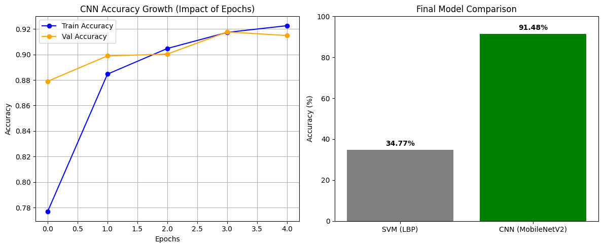

<div align="center">

<a href="README.md"></a>
<a href="README.fr.md"></a>
<a href="README.ar.md"></a>

<br/><br/>



<h1>🌿 PlantDoc AI System</h1>

<p>Automated diagnosis of plant leaf diseases — SVM+LBP vs CNN MobileNetV2, with a live web inference interface.</p>

**DUT Génie Informatique · Module : Python / AI · 2025–2026**

*Abderrahmane Aboutalib · Anas ElMarihi · Mohammed Bziz*
*Supervised by Pr. Al Semaa — EST Sidi Bennour, Université Chouaïb Doukkali*

</div>

---

## Overview

This project builds and compares two machine learning models for classifying diseases on plant leaves, using the [PlantVillage dataset](https://www.kaggle.com/datasets/abdallahalidev/plantvillage-dataset) filtered to **Tomato** and **Apple** (14 classes). The best model is then deployed as a REST API and consumed by a single-page web interface.

| Model | Approach | Validation Accuracy |
|---|---|---|
| SVM | LBP texture features (26-dim histogram) | 34.77% |
| **CNN** | MobileNetV2 + Transfer Learning (5 epochs) | **91.48%** |

---

## Repository Structure

```
PlantDoc-AI/
├── colab/
│   ├── plantdoc_pipeline.ipynb   ← full Google Colab notebook
│   └── plantdoc_pipeline.py      ← all cells merged (reference)
├── web/
│   └── index.html                ← PlantVision one-page interface
├── report/
│   └── PlantDoc_AI_Report.pdf
├── presentation/
│   └── PlantDoc_AI_Slides.pptx
├── assets/
│   └── performance_comparison.png
└── README.md
```

---

## How to Run

> Everything runs in **Google Colab** — no local installation required.

**1 — Open the notebook**
Upload `colab/plantdoc_pipeline.ipynb` to [Google Colab](https://colab.research.google.com/) and run cells in order.

**2 — Cells at a glance**

| Cell | What it does |
|---|---|
| 1 | Mount Google Drive · Download dataset via Kaggle API |
| 2 | Filter Tomato/Apple folders · Build `ImageDataGenerator` |
| 3 | Extract LBP features · Train & save SVM model |
| 4 | Build MobileNetV2 CNN · Train 5 epochs · Save `.h5` |
| 5 | Plot accuracy curves · Compare SVM vs CNN |
| 6 | Launch Flask server + ngrok tunnel → copy URL |

**3 — Use the web interface**
1. Open `web/index.html` in any browser
2. Paste the ngrok URL into the **COLAB URL** field at the top
3. Drop a `.jpg` or `.png` leaf image → **Analyze Leaf**

> ⚠️ The ngrok URL resets every time the Colab session restarts.

---

## Tech Stack

`Python` · `TensorFlow / Keras` · `scikit-learn` · `scikit-image` · `OpenCV` · `Flask` · `pyngrok` · `Matplotlib` · `Google Colab` · `HTML / CSS / JS`

---

## Key Results

- **+56.7 pp gap** between SVM (34.77%) and CNN (91.48%)
- CNN trains in ~10–20 min on a free T4 GPU with only **17,934 trainable parameters**
- Transfer Learning from ImageNet enables high accuracy in just 5 epochs
- Validation accuracy closely tracks training accuracy — no significant overfitting

---

## .gitignore Note

Model files (`.h5`, `.pkl`) and raw dataset folders are excluded from this repo due to size. Re-generate them by running the notebook from Cell 1.